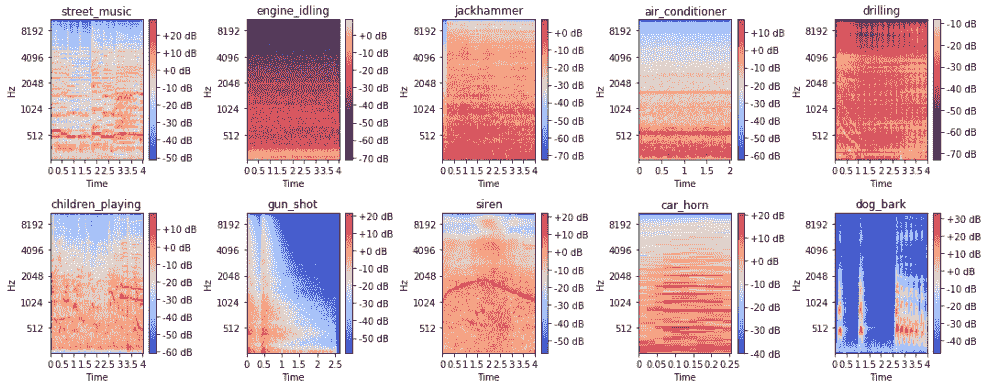
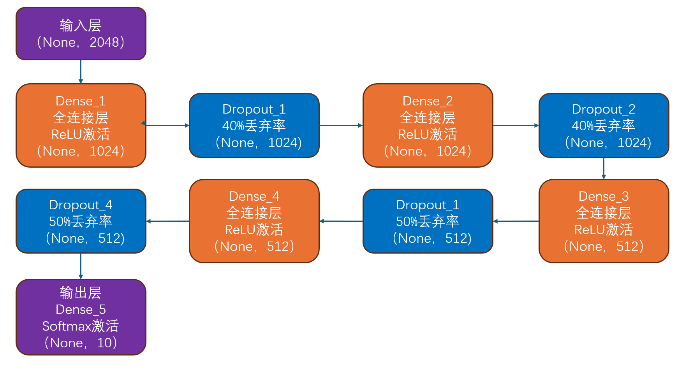
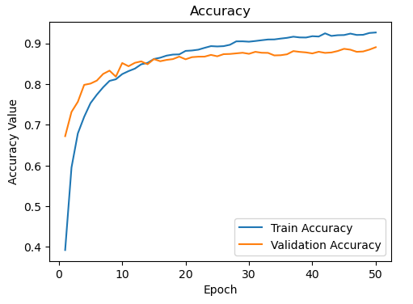
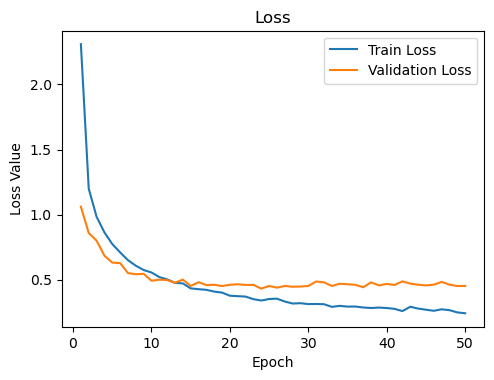
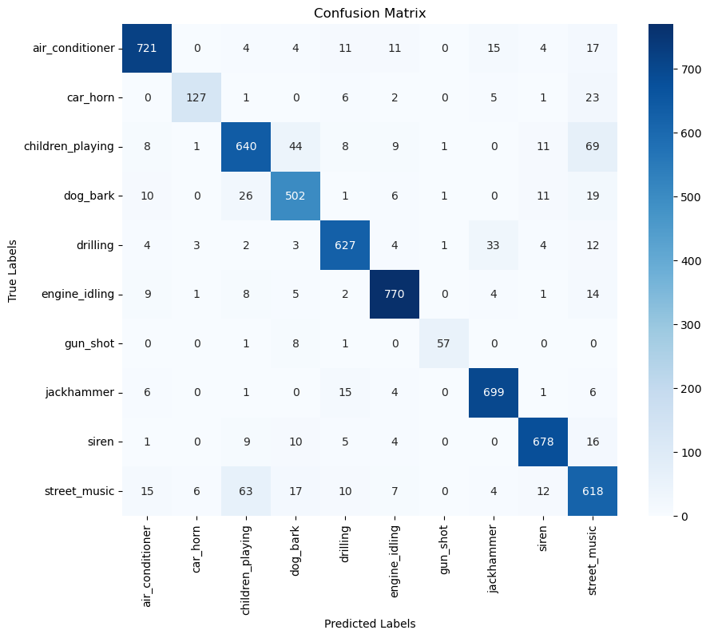
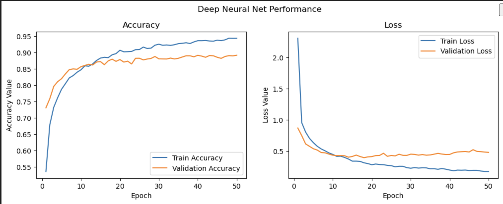
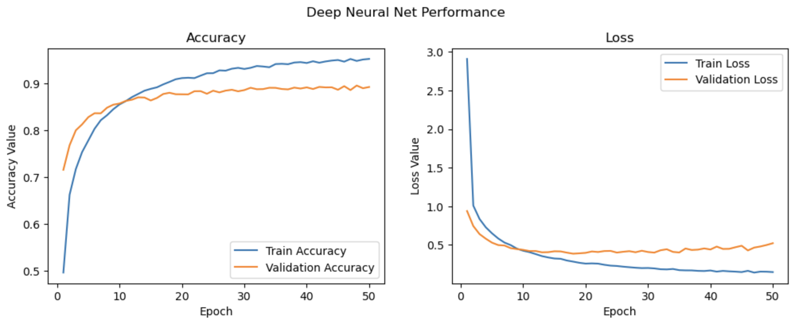

# 基于迁移学习的音频事件识别与分类研究

**PB24111600 王子涵**  

2025 年 6 月 5 日  

---

## **摘要**  

本文针对音频事件识别与分类问题，探讨了基于迁移学习的深度学习方法。通过 UrbanSound8K 数据集进行实验，采用梅尔频谱图等特征工程技术，结合预测的 VGG-16 模型提取音频特征，构建了高效的分类器。实验结果表明，模型在测试集上达到了约 89% 的准确率，展现了迁移学习在音频领域的优越性能和应用潜力。  

**关键词：** 音频事件识别；迁移学习；深度学习；梅尔频谱图；VGG-16；UrbanSound8K  

---

## 1 引言  

随着多媒体数据的迅猛增长，音频事件识别成为人工智能领域的一个重要课题。相比于图像和文本数据，音频数据的预测模型尚不完善，给音频事件分类带来了挑战。本文以 UrbanSound8K 数据集为基础，利用迁移学习技术借助图像领域的预测模型，实现音频事件的高效识别和分类，旨在推动音频分析技术的发展和应用。  

---

## 2 方法  

### 2.1 数据集介绍  

采用 UrbanSound8K 数据集，包含 8732 个标注音频样本，分为 10 个城市环境声音类别：  

- air_conditioner  
- car_horn  
- children_playing  
- dog_bark  
- drilling  
- engine_idling  
- gun_shot  
- jackhammer  
- siren  
- street_music  

数据分为 10 类，文件名用数字 0 到 9 表示音频类别信息，方便标签映射。  

### 2.2 音频预处理与特征提取  

- 使用 librosa 和 soundfile 库读取音频，统一采样率为 22,050 Hz。  
- 可视化音频波形、频谱图和梅尔频谱图，探索数据特性。  
- 提取音频的谐波与打击乐成分，分别计算其梅尔频谱图。  
- 结合梅尔频谱图及其导数构建三维特征图（64×64×3），统一输入尺寸。  

其中，读取音频所使用的代码如下：  

```python
# 读取音频数据
def get_sound_data(path, sr=22050):
    data, fsr = sf.read(path)
    data_resample = librosa.resample(data.T, fsr, sr)
    if len(data_resample.shape) > 1:
        data_resample = np.average(data_resample, axis=0)
    return data_resample, sr
```

构建三维特征图使用代码如下：  

```python
# 构建三维特征图
def extract_features(file_names, bands=64, frames=64):
    window_size = 512 * (frames - 1)
    log_specgrams_full = []
    log_specgrams_hp = []
    class_labels = []

    for fn in file_names: # 处理每个音频文件
        file_name = fn.split('\\')[-1]
        class_label = file_name.split('-')[1]
        sound_data, sr = get_sound_data(fn, sr=22050)

        for (start,end) in windows(sound_data, window_size): # 滑动窗口处理
            if len(sound_data[start:end]) == window_size:
                signal = sound_data[start:end]

                # 完整梅尔频谱
                melspec_full = librosa.feature.melspectrogram(y=signal, sr=sr, n_mels=bands)
                logspec_full = librosa.amplitude_to_db(melspec_full).T.flatten()[, np.newaxis].T

                # 谐波/打击乐分离
                y_harmonic, y_percussive = librosa.effects.hpss(signal)
                melspec_harmonic = librosa.feature.melspectrogram(y=y_harmonic, n_mels=bands)
                melspec_percussive = librosa.feature.melspectrogram(y=y_percussive, n_mels=bands)
                logspec_hp = np.average([
                    librosa.amplitude_to_db(melspec_harmonic),
                    librosa.amplitude_to_db(melspec_percussive)
                ], axis=0).T.flatten()[, np.newaxis].T

                log_specgrams_full.append(logspec_full)
                log_specgrams_hp.append(logspec_hp)
                class_labels.append(class_label)
```

**示例梅尔频谱图：**  


### 2.3 迁移学习模型构建——模型架构详细说明  

本研究采用预测的 VGG-16 网络作为特征提取器，去除其顶层分类器，仅保留卷积部分，以提取输入特征图的深层表示。该部分输出 2048 维的特征向量，随后输入到自定义的全连接神经网络中完成音频类别的分类任务。以下是全连接网络的具体层次结构及作用：  

| 层名称       | 类型           | 输出形状       | 作用说明                                                                 |
|--------------|----------------|----------------|--------------------------------------------------------------------------|
| 输入层       | -              | (None, 2048)   | 接收来自 VGG-16 卷积层提取的 2048 维特征向量                             |
| Dense_1      | 全连接层 (Dense) | (None, 1024)   | 线性变换并激活 (ReLU)，学习高维特征表示，降维同时保持信息                |
| Dropout_1    | Dropout        | (None, 1024)   | 随机丢弃 40% 神经元，减少过拟合，提高模型泛化能力                        |
| Dense_2      | 全连接层 (Dense) | (None, 1024)   | 进一步抽象和组合特征，增强模型表达能力                                   |
| Dropout_2    | Dropout        | (None, 1024)   | 继续防止过拟合，稳定训练过程                                             |
| Dense_3      | 全连接层 (Dense) | (None, 512)    | 降低维度，提取更紧凑的特征表示                                           |
| Dropout_3    | Dropout        | (None, 512)    | 50% 丢弃率，增强正则化效果                                               |
| Dense_4      | 全连接层 (Dense) | (None, 512)    | 进一步特征压缩，准备进行最终分类                                         |
| Dropout_4    | Dropout        | (None, 512)    | 继续防止神经元共适应，降低过拟合风险                                     |
| Dense_5（输出层） | 全连接层 (Dense) | (None, 10)     | 输出层，使用 softmax 激活，输出 10 类音频事件的概率分布                  |

**VGG-16 网络运行层次示意图：**  


在使用神经网络前，需先进行迁移学习特征提取：  

```python
# 迁移学习特征提取
def extract_tl_features(model, base_feature_data):
    dataset_tl_features = []
    for index, feature_data in enumerate(base_feature_data):
        pr_data = process_sound_data(feature_data)
        tl_features = model.predict(pr_data)
        dataset_tl_features.append(np.reshape(tl_features, tl_features.shape[1]))
    return np.array(dataset_tl_features)
```

在程序中，我们采用了如下代码来实现 VGG-16 网络：  

```python
model = models.Sequential()
model.add(layers.Dense(1024, activation='relu', input_shape=(input_dim,)))
model.add(layers.Dropout(0.4))
model.add(layers.Dense(1024, activation='relu'))
model.add(layers.Dropout(0.4))
model.add(layers.Dense(512, activation='relu'))
model.add(layers.Dropout(0.5))
model.add(layers.Dense(512, activation='relu'))
model.add(layers.Dropout(0.5))
model.add(layers.Dense(output_dim, activation='softmax'))
model.add(layers.Dropout(0.5))

model.compile(loss='categorical_crossentropy', optimizer='adam', metrics=['accuracy'])
```

---

## 3 结果  

### 3.1 训练与验证性能  

模型经过50个epoch训练，批大小128，验证准确率稳定在89%左右。  

**训练曲线如下：**  



### 3.2 测试集性能评估  

在测试集上的表现如下：  

| 指标     | 数值    |
|----------|---------|
| 准确率   | 0.8869  |
| 精确率   | 0.8864  |
| 召回率   | 0.8869  |
| F1得分   | 0.8861  |

各类指标报告显示模型对大多数类别的表现良好，特别是 gun_shot、jackhammer 等类别。  

**分类混淆矩阵如下：**  


误分类主要集中在相似环境声，如 street_music 与 children_playing 之间。  

---

## 4 讨论  

### 4.1 关于模型本身  

该模型通过将音频信号转换为视觉特征图，结合预训练的图像分类网络，成功实现了音频事件的分类任务。迁移学习显著降低了训练难度，提升了分类准确率。特征提取过程中，谐波与打击乐成分的分离增强了模型对音频特性的敏感度。未来工作可考虑引入更多音频特征或者改变特征提取手段以提升分类性能。  

### 4.2 调参  

在模型训练过程中，超参数的选择对最终性能有着重要影响。我们尝试了不同的学习率、批大小和网络结构，结果如下：  

#### 4.2.1 过拟合现象  

Epoch=50 时的 prediction[0] 为 0.99992，这甚至高于 Epoch=100 时的 predication[0] (约为 0.9842)。由此可见，过多的 epoch 可能导致过拟合，反而使实战中的预测精度下降。  

#### 4.2.2 batch size 的选择  

批大小的选择对训练速度和内存占用有显著影响。原模型使用的 batch size 为 128，我们尝试了将 batch size 取为 256（均为两套全连接层，全部启用 ReLU 函数），结果如下：  




可以看出，batch size 的大小对训练准确度的影响并不显著，但较大的 batch size 可以加快训练速度，在我们的实验中，batch size=256 时的训练时间大概比 batch size=128 时缩短了 17%。  

#### 4.2.3 调整模型结构  

观察特征工程部分所得到的梅尔频谱图，我们发现不同类型的声音在梅尔频谱图上有明显的差异，所以我们尝试了简化模型的结构，将全连接层的数量从 4 层减少到 2 层，结果如下：  

- 训练时间缩短了 50%，  
- 测试集上的准确率几乎不变  

由此可以看出：根据输入数据的结构，对模型做一些适当的简化可以在不损失性能的情况下显著提高模型的训练效率。  

---

## 5 结论  

本文提出了一种基于迁移学习的音频事件识别方法，结合特征工程与深度学习，有效解决了音频分类任务。实验验证了UrbanSound8K数据集上的高准确率，展示了迁移学习在音频领域的广泛应用潜力。该方法为智能监控、环境感知等实际应用提供技术支持。  

### 致谢  

感谢UrbanSound8K数据集提供者以及GitHub上相关开源工具的开发者。感谢ChatGPT母公司OpenAI以及相关开发者。感谢B站李沐老师的免费公开课程。感谢学长和老师的指导。
### 参考文献  

1. Salamon J, Jacoby C, Bello J P. A Dataset and Taxonomy for Urban Sound Research[C]// Proceedings of the 22nd ACM International Conference on Multimedia. ACM, 2014: 1041-1044.  
2. Piczak K J. Environmental sound classification with convolutional neural networks[C]//2015 IEEE 25th International Workshop on Machine Learning for Signal Processing (MLSP). IEEE, 2015: 1-6.  
3. Simonyan K, Zisserman A. Very deep convolutional networks for large-scale image recognition[J]. arXiv preprint arXiv:1409.1556, 2014.
```
